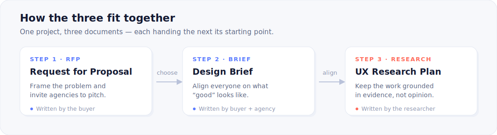

**Three battle-tested templates for scoping, briefing, and researching digital design projects —
for the people hiring an agency and the people doing the work.**

---

Most project templates are empty skeletons — headings with nothing underneath. These are different: every section comes with a short note on *why it matters* and a *tip* drawn from how good projects actually run, plus a fully worked example so you can see what "good" looks like before you write a word.

> [!NOTE]
> Maintained by **[UXAgencies.com](https://uxagencies.com)**, where we review European UX studios and see — across hundreds of engagements — what separates the projects that go smoothly from the ones that don't. These templates encode that pattern.

## Contents

- [Which one do I need?](#which-one-do-i-need)
- [The templates](#the-templates)
- [See a worked example](#see-a-worked-example)
- [Cheat sheet](#cheat-sheet)
- [How to use](#how-to-use)
- [What makes these different](#what-makes-these-different)
- [License & attribution](#license--attribution)
- [Contributing](#contributing)

## Which one do I need?

Different jobs, different documents. Reaching for the wrong one is the most common reason a project starts badly:

| Use the… | When… | Who writes it |
|---|---|---|
| **[RFP](rfp-template.md)** | You're about to invite agencies to pitch and want comparable, serious proposals. | The buyer |
| **[Design Brief](design-brief-template.md)** | The project is greenlit and everyone needs to agree on what "good" looks like. | Buyer + agency, together |
| **[UX Research Plan](ux-research-plan-template.md)** | You're about to run research and want it to answer real decisions. | The researcher / designer |

## The templates

- **[`rfp-template.md`](rfp-template.md)** — frame the problem (not the solution), set weighted evaluation criteria, and get proposals you can actually compare.
- **[`design-brief-template.md`](design-brief-template.md)** — align on outcomes, references *and anti-references*, and the one person who can say yes.
- **[`ux-research-plan-template.md`](ux-research-plan-template.md)** — tie research to a decision, pick the right method, write questions that aren't leading, and stay GDPR-clean.

## See a worked example

The best way to understand a template is to see one filled in well. The [`examples/`](examples/worked-example.md) folder carries a single fictional project — **Northbank, a digital bank redesigning its onboarding** — all the way through *all three* documents, so you can watch each one hand off to the next.

<b>Peek at how it opens →</b>

 

> **The one-liner:** *We are rebuilding account-opening for first-time mobile users so that more of them finish in one sitting.*
>
> **Primary objective:** lift onboarding completion from **38% → 60%** within two quarters.
>
> **Anti-reference:** *Most challenger-bank onboarding asks for everything up front. We want the opposite — earn trust before asking for the hard stuff.*

See the [full worked example →](examples/worked-example.md)

## Cheat sheet

The **[CHEATSHEET](CHEATSHEET.md)** is the bonus most people end up bookmarking: a one-page decision guide, a "which research method?" picker, red-flag checklists for spotting a too-vague brief, how to read a proposal (green flags vs. red flags), and a plain-English glossary.

## How to use

1. **Fork** the repo, or just download the one file you need — there's no code to run.
2. Work top to bottom. Each section opens with a `> [!NOTE]` on why it matters and a `> [!TIP]`; delete those once the section is filled in.
3. Replace every `[bracketed placeholder]` with your own content, and cut any section that genuinely doesn't apply. A short, honest document beats a padded one.

> [!TIP]
> Click **Use this template** at the top of the repo to spin up your own copy as a fresh repository — handy if your team keeps project docs in Git.

## What makes these different

- **Opinionated, not neutral.** They take positions — share your budget range, name one decision-maker, lead with the problem — because vague-but-safe templates produce vague projects.
- **The sections others skip.** Anti-references. A weighted scoring matrix. A research plan that pre-commits to *what you'll do with inconvenient findings*.
- **Built to teach.** The inline guidance means a first-time founder can produce a brief a senior PM would respect.
- **GDPR-aware.** Consent and data-handling are baked into the research plan — relevant wherever your participants sit.

## License & attribution

Released under **[Creative Commons Attribution 4.0](https://creativecommons.org/licenses/by/4.0/)**. Use, adapt, and share freely — including commercially — as long as you keep the line *"Template by UXAgencies.com"* when you **redistribute or republish the templates themselves**.

Documents you *create* with these (your actual RFP, brief, or research plan) are yours — no attribution needed.

## Contributing

Found a missing section, or a sharper way to phrase a prompt? [Open an issue](../../issues) or a pull request. Input from **both sides of the table** — buyers and agencies — is especially welcome.

---

*Need an agency to hand one of these to? Browse vetted European UX studios at **[UXAgencies.com](https://uxagencies.com)**.*

